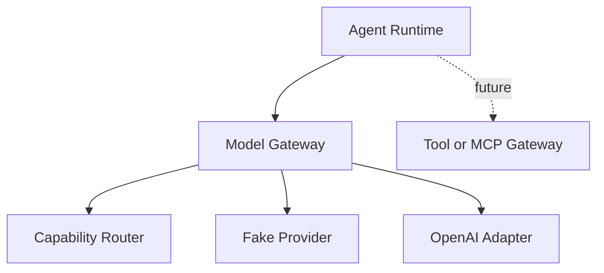

# Agent Model Gateway Proof of Concept

This repository demonstrates a small provider-neutral agent runtime and model
gateway. It is intentionally compact: the goal is to communicate architectural
boundaries to engineers and technical leaders, not to become a production
platform.

## What It Demonstrates

- Agents reference a logical model profile, not a provider model name.
- The model gateway resolves that profile to the first eligible provider/model.
- Provider SDK details are isolated inside provider adapters.
- Provider responses are normalized into shared domain contracts.
- The agent runtime validates structured output against an agent schema.
- The same runtime can use a deterministic fake provider or an optional OpenAI
  adapter.
- Agent overlays can append instructions and override allowed settings without
  copying the base agent.
- Mermaid diagrams document the runtime and gateway boundaries.

## Repository Map

```text
app/domain/      Provider-neutral Pydantic contracts
app/gateway/     Routing, registries, gateway service, and typed errors
app/providers/   Fake and OpenAI provider adapters
app/runtime/     Agent loading, overlays, runner, and output validation
agents/          Sample PR reviewer agent and payments overlay
config/          Logical profiles and concrete model descriptors
docs/            Architecture, system design, flowchart, ADR, and demo script
examples/        Fake-provider demo request
tests/           Unit and integration coverage
```

## Setup

```bash
python3 -m venv .venv
source .venv/bin/activate
pip install -e ".[dev]"
cp .env.example .env
```

Tests and demos use the fake provider by default, so no live API key is needed.
The OpenAI adapter is optional and isolated in `app/providers/openai_provider.py`.

## Demo Commands

List logical profiles:

```bash
amg profiles
```

List configured concrete models:

```bash
amg models
```

Resolve the base agent:

```bash
amg resolve-agent agents/pr-reviewer/agent.yaml
```

Resolve with the payments overlay:

```bash
amg resolve-agent agents/pr-reviewer/agent.yaml --overlay agents/overlays/payments-team.yaml
```

Run the default fake-provider example:

```bash
amg run examples/pr-reviewer-request.json
```

Start the HTTP API:

```bash
amg serve
```

Available endpoints:

```text
GET  /health
GET  /v1/profiles
GET  /v1/models
POST /v1/generate
POST /v1/agents/run
```

## Quality Gate

Before considering the repository complete, run:

```bash
ruff check .
ruff format --check .
mypy app
pytest
```

## Key Design Boundary



The gateway manages one model interaction. The runtime manages agent behavior,
context assembly, overlay resolution, structured validation, and future tool
loops.

## Future Work

Production evolution would add a durable workflow engine, distributed workers,
centralized policy services, immutable agent/config registries, complete MCP
tool integration, secrets management, tracing, audit logs, quotas, and cost
accounting.

## Real OpenAI Models

The offline demo uses `fake/fake-coding-model`. To route through OpenAI, set
`OPENAI_API_KEY` in `.env`, then use the sample OpenAI-backed agent. You can
also set `AMG_ENABLE_OPENAI=true` explicitly, but it is optional when a key is
present:

```bash
amg run examples/openai-pr-reviewer-request.json
```

For a lighter/cheaper-style agent profile, use:

```bash
amg run examples/openai-pr-triage-lite-request.json
```

See [docs/openai-real-models.md](docs/openai-real-models.md) for direct gateway,
agent, and HTTP API examples.

## Deployment Notes

For a simple EC2 demo, run the API with:

```bash
amg serve --host 0.0.0.0 --port 8000 --no-reload
```

See [docs/ec2-deployment.md](docs/ec2-deployment.md) for a minimal EC2 path and
the production gaps to close before exposing this beyond a demo environment.
