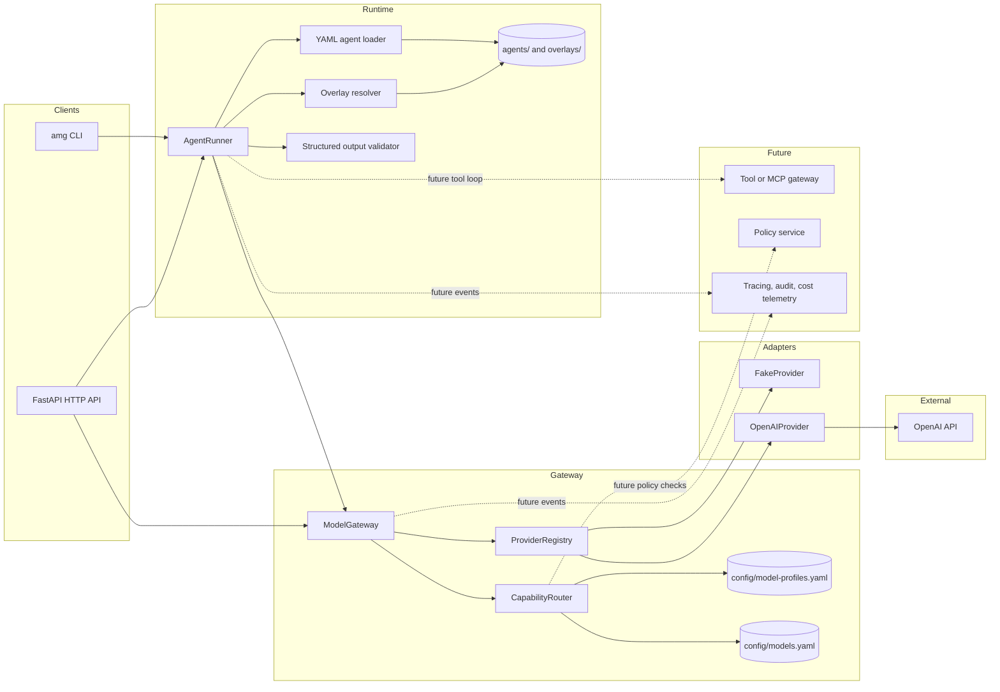

# Architecture

Implemented code paths:

- CLI: `app/cli.py`
- API: `app/api.py`
- Runtime: `app/runtime/`
- Domain contracts: `app/domain/`
- Gateway and router: `app/gateway/`
- Provider adapters: `app/providers/`
- Configuration: `config/`
