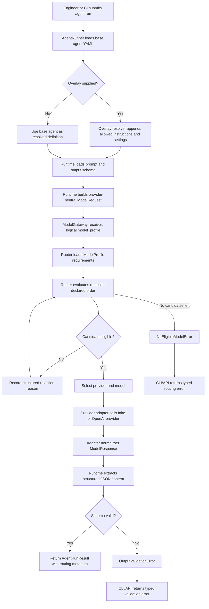

# Flowchart

```mermaid
flowchart TD
    A[Engineer or CI submits agent run] --> B[AgentRunner loads base agent YAML]
    B --> C{Overlay supplied?}
    C -->|Yes| D[Overlay resolver appends allowed instructions and settings]
    C -->|No| E[Use base agent as resolved definition]
    D --> F[Runtime loads prompt and output schema]
    E --> F
    F --> G[Runtime builds provider-neutral ModelRequest]
    G --> H[ModelGateway receives logical model_profile]
    H --> I[Router loads ModelProfile requirements]
    I --> J[Router evaluates routes in declared order]
    J --> K{Candidate eligible?}
    K -->|No| L[Record structured rejection reason]
    L --> J
    K -->|Yes| M[Select provider and model]
    J -->|No candidates left| N[NoEligibleModelError]
    M --> O[Provider adapter calls fake or OpenAI provider]
    O --> P[Adapter normalizes ModelResponse]
    P --> Q[Runtime extracts structured JSON content]
    Q --> R{Schema valid?}
    R -->|Yes| S[Return AgentRunResult with routing metadata]
    R -->|No| T[OutputValidationError]
    N --> U[CLI/API returns typed routing error]
    T --> V[CLI/API returns typed validation error]
```

The gateway stops at one normalized model interaction. Future tool execution would be
handled by the runtime between response normalization and final validation.
