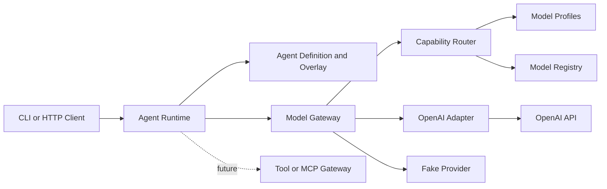
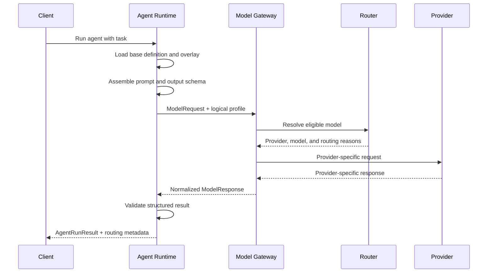

# Initial Architecture Direction

This file is an input to the implementation. Codex should replace it with diagrams grounded in the completed proof of concept.

## Logical components

## Request lifecycle

## Production evolution

The proof of concept should leave clear seams for:

- A durable workflow engine.
- Stateless workers and queues.
- MCP-based tool services.
- Organization policy evaluation.
- User and workload identity propagation.
- Distributed quotas and rate limiting.
- Tracing, audit logs, and cost accounting.
- An immutable agent artifact registry.
- Additional model providers.
