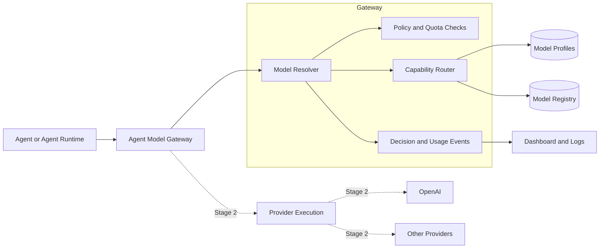
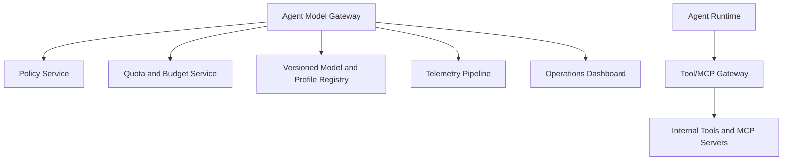

# Staged Architecture: Agent Model Gateway

## Purpose

The Agent Model Gateway gives a large organization one controlled place to
decide which model an agent should use, observe model activity, and eventually
enforce budgets, quotas, and provider policy.

The core idea is simple:

```text
Agents ask for capabilities.
The gateway selects an eligible provider/model.
The organization gets a decision record it can audit, monitor, and govern.
```

Agents should not hard-code provider model names like `gpt-5.4-mini`. They
should ask for a logical profile such as `coding_fast_openai`, and the gateway
should resolve that profile based on declared capabilities, policy, and routing
configuration.

## Architecture Direction



The gateway can start small. It does not need to call OpenAI on day one. The
first stage can simply answer: "For this agent, user, department, and requested
capability profile, which model is allowed?"

## Stage 1: Resolver-Only Gateway

In Stage 1, the gateway resolves a logical model profile into a concrete
provider/model. It does not execute the provider call.

This is useful when teams already have provider integrations but the
organization wants centralized model selection and auditability.

### Request

```json
{
  "model_profile": "coding_fast_openai",
  "constraints": {
    "data_classification": "internal",
    "minimum_context_window": 32000
  },
  "identity": {
    "tenant_id": "acme",
    "department_id": "payments",
    "team_id": "checkout-platform",
    "user_id": "user_123",
    "agent_id": "pr-reviewer",
    "agent_version": "0.1.0",
    "agent_instance_id": "repo:payments-api:pr-reviewer",
    "agent_run_id": "run_01JABC",
    "environment": "production",
    "source": "github-pr",
    "correlation_id": "trace_01JXYZ"
  }
}
```

### Response

```json
{
  "decision_id": "route_01JXYZ",
  "selected": {
    "provider": "openai",
    "model": "gpt-5.4-mini"
  },
  "routing": {
    "profile": "coding_fast_openai",
    "selected_provider": "openai",
    "selected_model": "gpt-5.4-mini",
    "rejected_candidates": [],
    "requirements": {
      "tool_calling": false,
      "structured_output": true,
      "minimum_context_window": 32000
    }
  },
  "policy": {
    "allowed": true,
    "budget_scope": "department:payments"
  }
}
```

### What The Agent Does Next

In Stage 1, the agent or calling application still performs the provider call:

```text
Agent -> Gateway: resolve model
Gateway -> Agent: use openai/gpt-5.4-mini
Agent -> OpenAI: call selected model
Agent -> Gateway or logs: optionally report usage
```

This gives the organization centralized routing decisions, but not yet
authoritative token usage. Usage is still caller-reported unless the gateway
executes the provider call.

## Stage 2: Execution Gateway

In Stage 2, provider calls move behind the gateway.

```text
Agent -> Gateway: model request with profile
Gateway -> Router: resolve provider/model
Gateway -> Provider Adapter: execute selected model
Gateway -> Agent: normalized response + usage + routing metadata
```

The agent no longer calls OpenAI or another provider directly. This makes the
gateway the authoritative place for:

- token usage
- latency
- provider errors
- model routing
- quota enforcement
- throttling
- cost allocation
- audit records

### Example Normalized Response

```json
{
  "response": {
    "content": [
      {
        "type": "json",
        "data": {
          "decision": "needs_review",
          "risk_level": "medium",
          "reason": "Payment retry behavior changed.",
          "recommended_reviewer": "payments-team"
        }
      }
    ],
    "tool_calls": [],
    "usage": {
      "prompt_tokens": 1200,
      "completion_tokens": 300,
      "total_tokens": 1500
    },
    "stop_reason": "stop",
    "provider_metadata": {
      "provider": "openai",
      "model": "gpt-5.4-mini"
    }
  },
  "routing": {
    "profile": "coding_fast_openai",
    "selected_provider": "openai",
    "selected_model": "gpt-5.4-mini",
    "rejected_candidates": []
  }
}
```

## Identity Model

At scale, the gateway must know which agent instance is making the request and
who owns it.

Important identifiers:

| Field | Meaning |
| --- | --- |
| `tenant_id` | Organization or customer boundary |
| `department_id` | Budget and policy owner |
| `team_id` | Operational owner |
| `user_id` | User or service that triggered the request |
| `agent_id` | Logical agent name |
| `agent_version` | Agent definition version |
| `agent_instance_id` | Specific deployment/configuration of the agent |
| `agent_run_id` | One execution attempt |
| `correlation_id` | Trace id across systems |

This identity envelope enables:

- department-level budgets
- team dashboards
- user-level audit
- per-agent throttling
- incident debugging
- cost allocation

## Observability And Dashboard

Every gateway decision should emit an event.

### Resolver Event

```json
{
  "event_id": "evt_01J",
  "event_type": "model_resolved",
  "timestamp": "2026-06-29T10:15:00Z",
  "decision_id": "route_01JXYZ",
  "tenant_id": "acme",
  "department_id": "payments",
  "team_id": "checkout-platform",
  "user_id": "user_123",
  "agent_id": "pr-reviewer",
  "agent_instance_id": "repo:payments-api:pr-reviewer",
  "agent_run_id": "run_01JABC",
  "model_profile": "coding_fast_openai",
  "selected_provider": "openai",
  "selected_model": "gpt-5.4-mini",
  "status": "allowed",
  "latency_ms": 12
}
```

### Execution Event

```json
{
  "event_id": "evt_01K",
  "event_type": "model_call_completed",
  "agent_run_id": "run_01JABC",
  "provider": "openai",
  "model": "gpt-5.4-mini",
  "prompt_tokens": 1200,
  "completion_tokens": 300,
  "total_tokens": 1500,
  "latency_ms": 1800,
  "status": "success"
}
```

The dashboard should start with simple views:

- live activity
- routing decisions
- rejected candidates
- usage by department
- usage by agent
- provider/model latency
- quota and throttle events

For the proof of concept, local JSONL events and `/dashboard` are enough. In
production, these events should flow to OpenTelemetry, an event stream, and an
analytics store.

## Future Capabilities

Once the resolver and execution gateway are stable, the same architecture can
support a broader control plane.



Future capabilities:

- model allowlists by department
- data-classification policy
- budget enforcement
- per-agent and per-user throttling
- provider failover and circuit breakers
- model evaluation and automatic route updates
- durable agent runs
- Tool/MCP gateway integration
- long-retention audit logs
- cost allocation and chargeback

## Roadmap

### Stage 1: Resolver Foundation

- Add identity-aware `POST /v1/resolve`.
- Return selected provider/model and routing metadata.
- Emit model resolution events.
- Provide a simple events endpoint and local dashboard.

### Stage 2: Usage And Dashboard

- Add caller-reported usage events.
- Track usage by agent, user, team, and department.
- Add dashboard filters and basic charts.
- Add rejected-route and no-eligible-model views.

### Stage 3: Execution Gateway

- Move provider calls behind the gateway.
- Capture authoritative token usage and latency.
- Normalize provider responses.
- Add provider retries, timeouts, and circuit breakers.

### Stage 4: Policy And Quotas

- Add budget and quota enforcement.
- Add model allowlists by department/team.
- Add data-classification checks.
- Add throttle and deny decisions before provider execution.

### Stage 5: Agent Platform

- Add durable workflow execution.
- Add Tool/MCP Gateway.
- Add immutable agent/profile/model registries.
- Add production observability, audit, and cost allocation.

## Design Principle

The gateway should grow from a resolver into an execution and governance layer,
but it should keep a clear boundary:

```text
Runtime owns agent behavior.
Gateway owns model selection, provider invocation, and model-call governance.
Tool/MCP Gateway owns tool execution and side effects.
```

That separation keeps the system scalable, observable, and understandable as
the number of agents and model providers grows.
