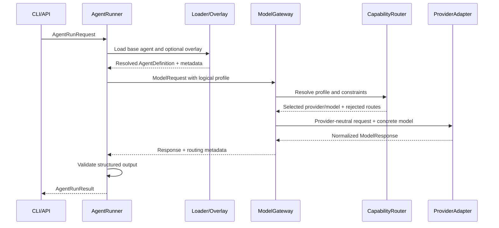

# System Design

## Executive Summary

This repository is a small proof of concept for a provider-neutral agent runtime
and model gateway. Agents reference logical model profiles such as `coding_high`.
The gateway resolves those profiles to concrete provider models by checking
declared capabilities, then returns a normalized response. The runtime owns
agent behavior: loading definitions, applying overlays, constructing prompts,
calling the gateway, and validating structured output.

## Problem Statement

Many agent implementations couple workflow code directly to provider model
names and SDK response shapes. That makes provider changes risky, obscures
capability assumptions, and encourages teams to copy agent definitions when they
only need small local customization. This proof of concept shows a clearer
boundary: agents depend on profiles, the gateway owns provider selection, and
provider SDKs stay inside adapters.

## Goals

- Keep agent definitions provider-neutral.
- Select concrete models through deterministic capability checks.
- Normalize provider responses and tool calls.
- Validate final structured output in the runtime.
- Support a deterministic fake provider for tests and demos.
- Allow limited overlays without copying a base agent.
- Document the architecture in plain text and Mermaid.

## Non-Goals

- Production secret management.
- Durable workflow orchestration.
- Distributed queues or workers.
- Persistent memory.
- Complex semantic or machine-learning-based routing.
- Full MCP implementation.
- More than one real provider adapter.

## Core Design Principles

The proof of concept favors explicit interfaces over clever abstractions.
Domain contracts live in `app/domain/` and avoid provider SDK types. The gateway
contains no workflow logic and does not execute tools. The runtime has no
provider-specific branches. Configuration is data, not code, and tests use the
fake provider by default.

## Component Responsibilities

`app/runtime/loader.py` loads YAML agent definitions, prompt files, and output
schemas. `app/runtime/overlays.py` applies deliberately small overlay rules:
append instructions, override allowed scalar settings, reject locked fields, and
reject tool additions unless explicitly allowed.

`app/runtime/runner.py` builds a provider-neutral `ModelRequest`, calls the
gateway, extracts structured JSON from the normalized response, and validates it
with `app/runtime/validation.py`.

`app/gateway/router.py` evaluates profile routes in order. It records rejected
candidates with reasons and raises `NoEligibleModelError` when no route
qualifies.

`app/gateway/service.py` executes exactly one model interaction through the
selected provider. It does not execute tools and does not fall back to another
model after an execution error.

`app/providers/fake_provider.py` returns deterministic normalized responses.
`app/providers/openai_provider.py` is the only module that imports the OpenAI
SDK.

## Domain Contracts

The key contracts are:

- `ModelRequest` and `ModelResponse`
- `Message` and `ContentBlock`
- `ToolDefinition` and `ToolCall`
- `TokenUsage`
- `ModelCapabilities`, `ModelDescriptor`, and `ModelProfile`
- `AgentDefinition`, `AgentRunRequest`, and `AgentRunResult`

The normalized `ModelResponse` contains content blocks, normalized tool calls,
token usage, stop reason, and generic provider metadata.

## Request Sequence

## Capability-Based Routing

Profiles in `config/model-profiles.yaml` declare requirements and ordered
routes. Concrete models in `config/models.yaml` declare capabilities, data
classifications, and cost metadata. The router checks profile requirements,
request constraints, provider registration, and concrete model existence. It
selects the first eligible route and includes rejected candidates in metadata.

## Failure and Fallback Semantics

Routing fallback only happens before execution: ineligible candidates are
skipped with recorded reasons. Once the gateway selects a provider and calls it,
the gateway does not silently try another model. Retry is reserved for explicitly
retryable provider failures with a low fixed limit.

No eligible route produces `NoEligibleModelError`. Invalid structured output
produces `OutputValidationError`. API endpoints convert these into clear HTTP
errors.

## Agent Versioning

The sample agent includes `api_version`, `kind`, metadata name, and semantic
version. A production system would store immutable agent artifacts in a registry
and reference them by digest or version. This proof of concept keeps files in
`agents/` to make review and demos simple.

## Overlay Customization

Overlays are intentionally limited. They may append instructions and override
settings only when the base agent marks those fields as allowed. Locked fields,
including the sample agent's model profile and tool additions, are rejected.
Resolution metadata preserves base and overlay source paths plus the applied
changes.

## Security and Identity Boundaries

Provider credentials must stay out of config files and logs. `.env.example`
contains placeholders only. The OpenAI adapter can be constructed with an
injected client, which keeps tests credential-free. The gateway does not log
prompt contents or authorization headers. In production, workload identity and
policy checks would sit in front of gateway execution.

## Observability

The implemented proof of concept returns routing metadata and token usage to
callers. A production version should emit structured events for route decisions,
provider latency, token usage, cost, validation failures, and policy decisions.
Trace IDs should flow from API or CLI entrypoints through runtime and gateway
calls.

## Testing and Evaluation

Tests cover domain validation, routing order, rejected candidates, fake-provider
normalization, mocked OpenAI mapping, overlay rules, JSON Schema validation,
end-to-end fake execution, API endpoints, and CLI smoke behavior. No test calls
a live provider.

## Horizontal Scaling Path

The current services are in-process and file-backed. A production path would
move configuration into a versioned registry, run stateless API and worker
processes, place durable work on a queue, and centralize observability and
policy services. Provider adapters can remain local to workers or move behind a
separate gateway service.

## Deployment Evolution

The proof of concept can run locally with `agent-poc` or FastAPI. A first
production deployment could package the API as a container, mount read-only
agent/config artifacts, and inject provider credentials through a secrets
manager. Later versions can add distributed workers and per-team policy.

## Trade-Offs

The JSON Schema validator implements only the subset used by the demo. This
keeps dependencies and behavior small, but production should use a complete
validator. File-backed configuration is easy to understand, but it does not
provide central governance. The fake provider is deterministic, which is ideal
for tests, but it cannot evaluate model quality.

## Future MCP and Durable Workflow Integration

Future tool or MCP calls belong in the runtime after the gateway returns
normalized tool calls. The gateway should continue to manage only individual
model interactions. A durable workflow engine could persist each step, execute
tools through an MCP gateway, and then call the model gateway again with updated
context.
