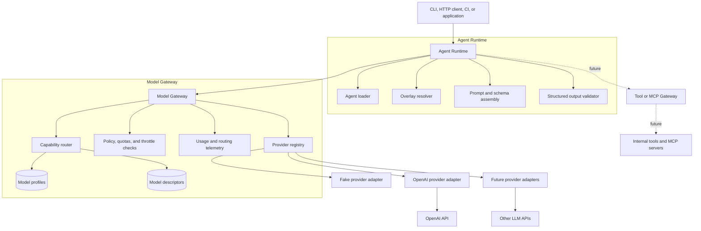
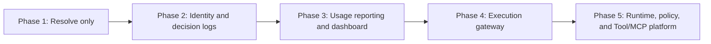
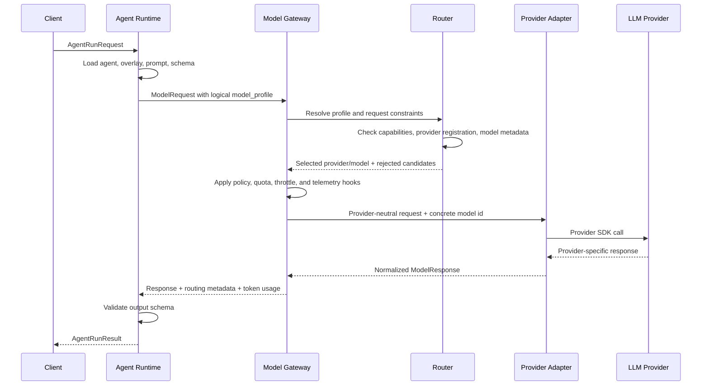
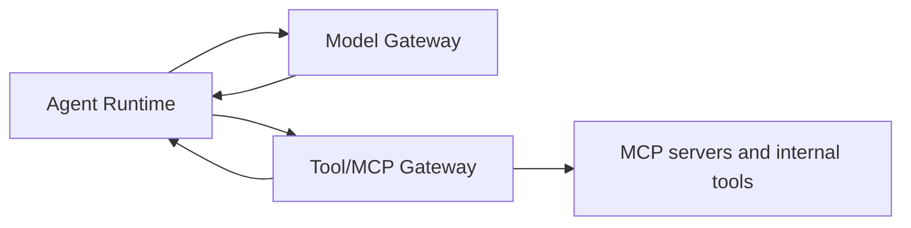

# Technical Design: Agent Model Gateway

## Executive Summary

The Agent Model Gateway is a control point between agent runtimes and model
providers. Agents ask for capabilities through logical model profiles, such as
`coding_power_openai` or `coding_fast_openai`, instead of naming provider models
directly. The gateway resolves those profiles to an eligible provider/model,
performs the provider call through an adapter, normalizes the response, and
returns routing and usage metadata.

The important distinction is that the gateway does not hand a model client back
to the agent. The agent never calls OpenAI or another provider directly. The
gateway remains in the execution path so it can enforce policy, capture token
usage, emit analytics, throttle requests, and change routing when an alternative
model satisfies the same required capabilities.

## Core Concept

```text
Agent asks for:        "coding_fast_openai"
Profile requires:     structured output, 32k+ context, public/internal data
Gateway selects:      openai/gpt-5.4-mini
Gateway returns:      normalized ModelResponse + routing metadata + token usage
Runtime validates:    structured output against the agent schema
```

Agents depend on contracts and profiles:

- `AgentDefinition` declares the logical `model_profile`.
- `ModelProfile` declares required capabilities and ordered routes.
- `ModelDescriptor` declares what a concrete provider model can do.
- `ModelRequest` and `ModelResponse` are provider-neutral.
- Provider adapters translate between those contracts and provider SDKs.

## Architecture



Implemented proof-of-concept modules:

- Runtime: `app/runtime/`
- Gateway: `app/gateway/`
- Provider adapters: `app/providers/`
- Domain contracts: `app/domain/`
- Profiles and models: `config/`
- Sample agents: `agents/`

## Incremental Adoption Path

Large organizations do not need to adopt a full execution gateway on day one.
The architecture can start with model resolution only and move provider
execution behind the gateway later.



The first increment is now implemented as `POST /v1/resolve` and
`amg resolve-model`. It returns a selected provider/model and a structured
routing decision without calling the provider. This is useful when teams still
own their direct provider calls but want centralized model selection and
governance metadata.

The trade-off is that resolver-only mode cannot authoritatively capture token
usage. It can emit decision events, but usage remains caller-reported until
provider execution moves behind the gateway.

## Identity Context

Every resolver request should carry an identity envelope. This is what lets the
gateway connect routing decisions to a user, department, team, agent instance,
and run.

```json
{
  "tenant_id": "acme",
  "department_id": "payments",
  "team_id": "checkout-platform",
  "user_id": "user_123",
  "agent_id": "pr-reviewer",
  "agent_version": "0.1.0",
  "agent_instance_id": "repo:payments-api:pr-reviewer",
  "agent_run_id": "run_01JABC",
  "environment": "production",
  "source": "github-pr",
  "correlation_id": "trace_01JXYZ"
}
```

Identifier roles:

| Field | Purpose |
| --- | --- |
| `tenant_id` | Top-level organization or customer boundary |
| `department_id` | Budget and policy owner |
| `team_id` | Operational owner |
| `user_id` | Human or service identity that triggered the request |
| `agent_id` | Stable logical agent name |
| `agent_version` | Version of the agent definition |
| `agent_instance_id` | Deployment or configuration instance of the agent |
| `agent_run_id` | One execution attempt |
| `correlation_id` | Cross-service trace/log join key |

## Resolver-Only Request

```json
{
  "model_profile": "coding_high",
  "constraints": {
    "data_classification": "internal",
    "minimum_context_window": 32000
  },
  "identity": {
    "tenant_id": "acme",
    "department_id": "payments",
    "team_id": "checkout-platform",
    "user_id": "user_123",
    "agent_id": "pr-reviewer",
    "agent_version": "0.1.0",
    "agent_instance_id": "repo:payments-api:pr-reviewer",
    "agent_run_id": "run_01JABC",
    "environment": "development"
  }
}
```

Example response:

```json
{
  "decision_id": "route_...",
  "selected": {
    "provider": "fake",
    "model": "fake-coding-model"
  },
  "routing": {
    "profile": "coding_high",
    "selected_provider": "fake",
    "selected_model": "fake-coding-model",
    "rejected_candidates": []
  },
  "policy": {
    "allowed": true,
    "budget_scope": "department:payments"
  }
}
```

CLI example:

```bash
amg resolve-model examples/resolve-model-request.json
```

HTTP example:

```bash
curl -sS http://127.0.0.1:8000/v1/resolve \
  -H "Content-Type: application/json" \
  -d @examples/resolve-model-request.json
```

## Request Lifecycle



The proof of concept implements the routing, provider call, normalization, and
validation path. Production policy, quota, throttle, and telemetry persistence
are documented extension points.

## Sample Agent Definition

An agent names a profile, not a provider model:

```yaml
api_version: agents.example.io/v1
kind: Agent

metadata:
  name: openai-pr-triage-lite
  version: 0.1.0
  owner: developer-platform
  description: Quickly triages a pull request using a lower-cost OpenAI profile.

spec:
  model_profile: coding_fast_openai

  instructions:
    system_file: prompt.md

  capabilities:
    required:
      tool_calling: false
      structured_output: true
      minimum_context_window: 32000

  tools: []

  output:
    schema_file: output.schema.json
```

The same agent can move to a different provider or model by changing profile
configuration, provided the new route still satisfies the declared
capabilities.

## Profile and Model Configuration

Profiles describe requirements and ordered routes:

```yaml
profiles:
  coding_fast_openai:
    requirements:
      tool_calling: false
      structured_output: true
      minimum_context_window: 32000
      allowed_data_classifications:
        - public
        - internal
    routes:
      - provider: openai
        model: gpt-5.4-mini
```

Concrete model descriptors describe capabilities:

```yaml
models:
  - provider: openai
    model: gpt-5.4-mini
    capabilities:
      tool_calling: true
      structured_output: true
      streaming: true
      max_context_window: 400000
    data_classifications:
      - public
      - internal
```

The router rejects a candidate if it is missing, its provider is not registered,
its context window is too small, it lacks structured output or tool calling, or
it violates data classification and cost constraints.

## Gateway Call from Python

Applications can call the gateway directly without HTTP:

```python
import asyncio

from app.config import build_gateway
from app.domain import Message, MessageRole, ModelRequest


async def main() -> None:
    gateway = build_gateway(include_openai=True)
    result = await gateway.generate(
        ModelRequest(
            model_profile="coding_fast_openai",
            messages=[
                Message.from_text(
                    MessageRole.USER,
                    "Summarize why capability routing matters.",
                )
            ],
        )
    )

    print(result.routing.model_dump(mode="json"))
    print(result.response.model_dump(mode="json"))


asyncio.run(main())
```

For the CLI and API, OpenAI is enabled automatically when `OPENAI_API_KEY` is
present unless `AMG_ENABLE_OPENAI=false` is set.

## Gateway Call over HTTP

Start the gateway:

```bash
amg serve
```

Call the provider-neutral generation endpoint:

```bash
curl -sS http://127.0.0.1:8000/v1/generate \
  -H "Content-Type: application/json" \
  -d '{
    "model_profile": "coding_fast_openai",
    "messages": [
      {
        "role": "user",
        "content": [
          {"type": "text", "text": "Summarize this architecture in one sentence."}
        ]
      }
    ]
  }'
```

Run a full agent through the runtime:

```bash
curl -sS http://127.0.0.1:8000/v1/agents/run \
  -H "Content-Type: application/json" \
  -d @examples/openai-pr-triage-lite-request.json
```

## Normalized Response and Metadata

Provider adapters return a shared response shape:

```json
{
  "content": [
    {
      "type": "json",
      "data": {
        "decision": "needs_review",
        "risk_level": "medium",
        "reason": "Payment behavior changed.",
        "recommended_reviewer": "payments-team"
      }
    }
  ],
  "tool_calls": [],
  "usage": {
    "prompt_tokens": 46,
    "completion_tokens": 24,
    "total_tokens": 70
  },
  "stop_reason": "stop",
  "provider_metadata": {
    "provider": "openai",
    "model": "gpt-5.4-mini"
  }
}
```

The gateway also returns routing metadata:

```json
{
  "profile": "coding_fast_openai",
  "selected_provider": "openai",
  "selected_model": "gpt-5.4-mini",
  "rejected_candidates": [],
  "requirements": {
    "tool_calling": false,
    "structured_output": true,
    "minimum_context_window": 32000
  }
}
```

This is the basis for analytics, audit, budget enforcement, and route
explainability.

## Observability and Dashboard

The gateway emits redacted structured events for resolver decisions. The local
proof of concept writes JSONL events to `logs/gateway-events.jsonl`, exposes
recent events at `/v1/events/recent`, and includes a simple HTML dashboard at
`/dashboard`.

Example event:

```json
{
  "event_id": "evt_...",
  "event_type": "model_resolved",
  "timestamp": "2026-06-29T10:15:00Z",
  "decision_id": "route_...",
  "identity": {
    "tenant_id": "acme",
    "department_id": "payments",
    "team_id": "checkout-platform",
    "user_id": "user_123",
    "agent_id": "pr-reviewer",
    "agent_version": "0.1.0",
    "agent_instance_id": "repo:payments-api:pr-reviewer",
    "agent_run_id": "run_01JABC",
    "environment": "development"
  },
  "model_profile": "coding_high",
  "selected_provider": "fake",
  "selected_model": "fake-coding-model",
  "status": "allowed",
  "latency_ms": 3
}
```

Production deployments should send these events to OpenTelemetry, an event
stream, and an analytical store. The same event schema can power live activity
views, department usage reports, routing audits, throttling dashboards, and
provider health views.

## Control Plane Responsibilities

Because all model calls pass through the gateway, it is the natural place to
centralize controls that are difficult to enforce in each agent:

| Concern | Gateway responsibility |
| --- | --- |
| Token usage | Capture prompt, completion, and total tokens per call |
| Cost accounting | Estimate or record cost per team, agent, profile, provider, and model |
| Quotas | Reject or queue requests when a team or agent exceeds limits |
| Throttling | Slow or block high-volume agents before provider execution |
| Routing | Select the first eligible route, or reroute when policy allows |
| Capability enforcement | Prevent silent downgrades to models missing required features |
| Data policy | Restrict models by data classification and provider approval |
| Audit | Record selected model, rejected candidates, latency, errors, and run ids |
| Provider isolation | Keep SDK types and provider-specific errors inside adapters |

The proof of concept returns usage and routing metadata to callers. A production
gateway would also persist those records to logs, metrics, traces, and billing
or governance stores.

## Swapping, Rerouting, and Throttling

The gateway can swap models only within policy and capability constraints. For
example, it may route `coding_fast_openai` from `gpt-5.4-mini` to a future
provider model if that model supports structured output, satisfies the required
context window, and is allowed for the request data classification.

It should not silently downgrade a structured-output agent to a model that
cannot produce structured output. It should not route sensitive data to a model
or provider that is not approved for that classification. In those cases, the
correct behavior is a typed routing error with rejected-candidate reasons.

Throttle decisions should happen before provider execution:

```text
Request arrives
  -> identify agent/team/profile
  -> check quota and budget
  -> check model eligibility
  -> execute provider call only if allowed
```

## Runtime Boundary

The runtime owns workflow behavior:

- Loading agent definitions and overlays.
- Building prompts and schemas.
- Managing future multi-step tool loops.
- Calling the gateway.
- Validating final structured output.

The gateway owns model interactions:

- Resolving profiles.
- Checking model capabilities.
- Applying gateway-level policy.
- Invoking provider adapters.
- Normalizing provider responses.
- Capturing usage and routing analytics.

## What the Gateway Must Not Do

- It must not contain agent-specific workflow logic.
- It must not execute tools.
- It must not leak provider SDK types outside provider adapters.
- It must not silently fall back to weaker models.
- It must not log secrets, authorization headers, or sensitive prompt contents.

## Tool and MCP Gateway Extension

Tool execution should sit beside the runtime, not inside the model gateway:



The model gateway returns normalized `ToolCall` objects. The runtime decides
whether to execute them. The Tool/MCP Gateway validates tool permissions,
checks policy, scopes credentials, invokes MCP servers or internal tools, and
returns normalized tool result messages. The runtime then calls the model
gateway again with updated context.

This preserves the clean boundary: the model gateway handles model calls; the
runtime and tool gateway handle workflow side effects.

## Production Shape

A production deployment would add:

- A persistent model/profile registry.
- A policy service for data classification, approved providers, and write
  controls.
- Token, cost, latency, and error telemetry.
- Quota and budget enforcement.
- Request identity and team ownership.
- Durable agent run state.
- Queue-backed workers for long-running agent workflows.
- Complete JSON Schema validation.
- A Tool/MCP Gateway for side-effecting actions.

The core design remains the same: agents request capabilities, the gateway owns
provider/model selection and invocation, and provider SDKs stay isolated behind
adapters.
