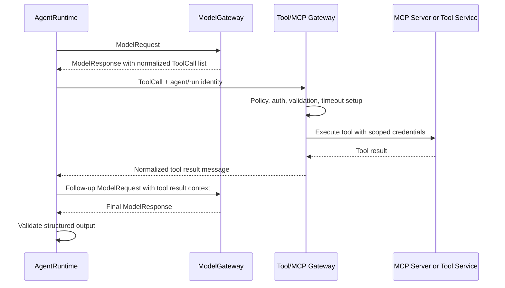

# Proposed Tool and MCP Gateway

The current proof of concept does not execute tools. That is intentional: the
model gateway should manage model interactions, while the runtime should manage
agent behavior and tool loops.

## Where It Fits

## Responsibilities

The Tool/MCP Gateway would own:

- Tool catalog discovery and versioning.
- Tool input schema validation.
- Agent/team/repository authorization.
- Data classification checks.
- Human approval checks for writes.
- Credential scoping and secret isolation.
- Timeouts, concurrency limits, and result size limits.
- Audit records with redacted arguments and summarized outputs.
- Normalized tool result messages for the next model turn.

## MCP Integration

An MCP server exposes tools with names, descriptions, and input schemas. The
gateway would translate those MCP tool definitions into this repository's
provider-neutral `ToolDefinition` objects when building a model request.

When the model returns normalized `ToolCall` objects, the runtime would pass
them to the Tool/MCP Gateway. The gateway would invoke the matching MCP server,
normalize the result, and return it to the runtime. The runtime then decides
whether to call the model again, stop, or fail the run.

## Why Not Put Tools in the Model Gateway?

Tool execution is workflow behavior. It needs policy, identity, approvals,
state, retries, and audit semantics that are broader than one model call. If the
model gateway executed tools, it would become an agent runtime by accident.

Keeping tools in the runtime layer makes it easier to add durable workflows,
human approval gates, and MCP services without changing provider routing.
